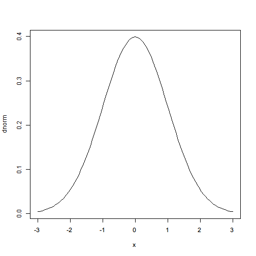
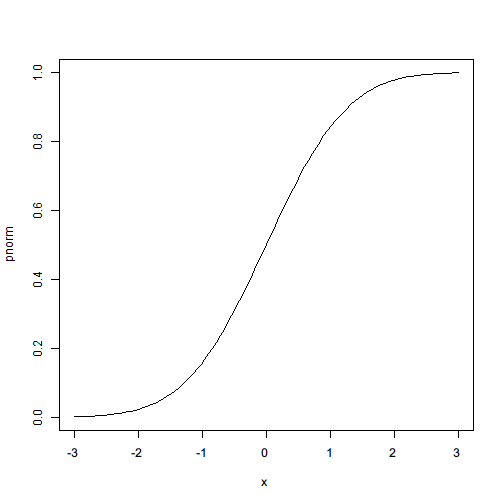

# Statistical functions


```r
> x.norm <- rnorm(20)
> mean(x.norm)
```

```
[1] -0.2301
```

```r
> sd(x.norm)
```

```
[1] 0.8164
```

```r
> median(x.norm)
```

```
[1] -0.2491
```

```r
> quantile(x.norm, probs = c(0.5, 0.8))
```

```
    50%     80% 
-0.2491  0.6236 
```

```r
> max(x.norm)
```

```
[1] 1.118
```

```r
> min(x.norm)
```

```
[1] -1.767
```

```r
> pmax(c(1, 2, 3), c(2, 3, 1))
```

```
[1] 2 3 3
```

```r
> pmin(c(1, 2, 3), c(2, 3, 1), c(3, 2, 1))
```

```
[1] 1 2 1
```

```r
> summary(x.norm)
```

```
   Min. 1st Qu.  Median    Mean 3rd Qu.    Max. 
 -1.770  -0.880  -0.249  -0.230   0.584   1.120 
```

```r
> 
> 
> set.seed(100)
> sample(c(1, 2, 3), size = 2, replace = FALSE)
```

```
[1] 1 3
```

```r
> sample(c("a", "b", "z"), size = 10, replace = TRUE)
```

```
 [1] "b" "a" "b" "b" "z" "b" "b" "a" "b" "z"
```

```r
> rnorm(20, mean = 10, sd = 2)
```

```
 [1]  8.836 11.429  8.349  9.280 10.180 10.193  9.597 11.480 10.247  9.941
[11]  9.222 11.022  8.172 14.621  9.124 11.528 10.524 11.547  8.371  9.123
```

```r
> rbinom(20, size = 10, prob = 0.6)
```

```
 [1] 7 7 6 7 8 7 6 7 6 5 3 5 6 7 6 6 7 5 6 7
```

```r
> runif(20)
```

```
 [1] 0.57256 0.96700 0.66178 0.62470 0.85665 0.77478 0.83403 0.09151
 [9] 0.45953 0.59940 0.91972 0.98282 0.03780 0.57794 0.73331 0.24874
[17] 0.30074 0.73347 0.90695 0.20982
```

```r
> runif(20, min = 10, max = 20)
```

```
 [1] 13.58 14.48 19.06 13.89 15.17 11.25 10.30 17.72 13.27 13.89 10.41
[12] 13.61 15.71 16.85 19.71 17.02 10.12 15.36 18.37 18.07
```

```r
> rgamma(20, shape = 0.5)
```

```
 [1] 0.0091814 1.6197939 0.0565046 0.2205470 0.1740602 0.4265680 0.0793420
 [8] 0.4714080 0.3124512 0.6353470 0.0288982 2.1413096 0.0005384 0.5158260
[15] 0.0005071 0.3230394 0.0111670 0.0010014 0.4807671 0.8817755
```

```r
> 
> plot(dnorm, xlim = c(-3, 3))
```

 

```r
> plot(pnorm, xlim = c(-3, 3))
```

 

```r
> qnorm(c(0.01, 0.99))
```

```
[1] -2.326  2.326
```

```r
> 
> table(sample(letters[1:3], 100, T))
```

```

 a  b  c 
31 31 38 
```

```r
> table(sample(letters[1:3], 100, T), sample(LETTERS[1:4], 100, T))
```

```
   
     A  B  C  D
  a  3  6  9  9
  b 10 15  9 12
  c  5 11  7  4
```


